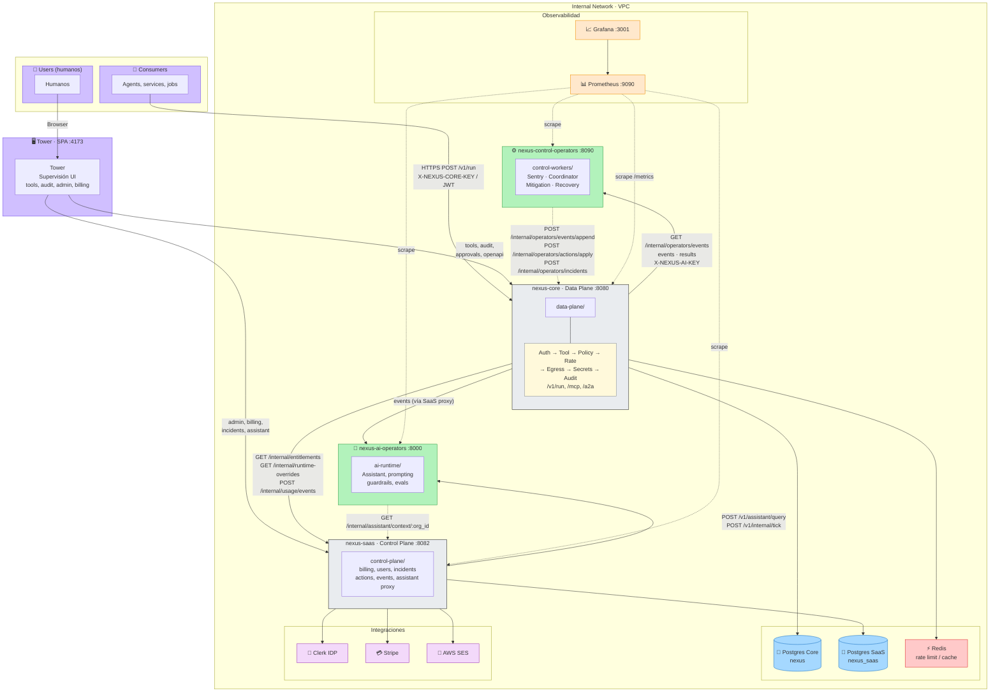

# Nexus — Diagrama de arquitectura

Diagrama actualizado con todos los detalles. Colores alineados con la paleta del Excalidraw original para poder replicar o importar.

**Paleta para Excalidraw (hex):**
- Fondo servicios data/control: `#e9ecef` (stroke `#1e1e1e`)
- Pipeline label: `#fff9db` (stroke `#868e96`)
- Control/IA operators: `#b2f2bb` (stroke `#2f9e44`)
- Usuarios/Tower/Consumers: `#d0bfff` (stroke `#7048e8`)
- Postgres: `#a5d8ff` (stroke `#1971c2`)
- Redis: `#ffc9c9` (stroke `#e03131`)
- Clerk/Stripe/SES: `#f3d9fa` (stroke `#9c36b5`)
- Prometheus/Grafana: `#ffe8cc` (stroke `#f08c00`)
- Flechas internas (entitlements, events): `#f08c00`
- Flechas públicas (run): `#2f9e44`

---

---

## Resumen de flujos

| Origen | Destino | Contrato / etiqueta |
|--------|---------|----------------------|
| Consumers | nexus-core | `POST /v1/run`, `POST /mcp`, `POST /a2a/call` |
| Tower | nexus-core | tools, audit, approvals, openapi |
| Tower | nexus-saas | admin, billing, incidents, assistant |
| nexus-core | nexus-saas | entitlements, runtime-overrides, usage/events |
| nexus-core | Control Operators | `/internal/operators/events` (poll), events/results |
| nexus-core | AI Operators | events vía proxy SaaS |
| Control Operators | nexus-core | events/append, actions/apply, incidents, policy-proposals |
| nexus-saas | AI Operators | assistant/query, internal/tick |
| AI Operators | nexus-saas | internal/assistant/context |
| nexus-core | Postgres Core, Redis | persistencia, rate limit |
| nexus-saas | Postgres SaaS, Clerk, Stripe, SES | persistencia e integraciones |
| Prometheus | todos los servicios | scrape /metrics (dashed) |
| Grafana | Prometheus | datasource |
