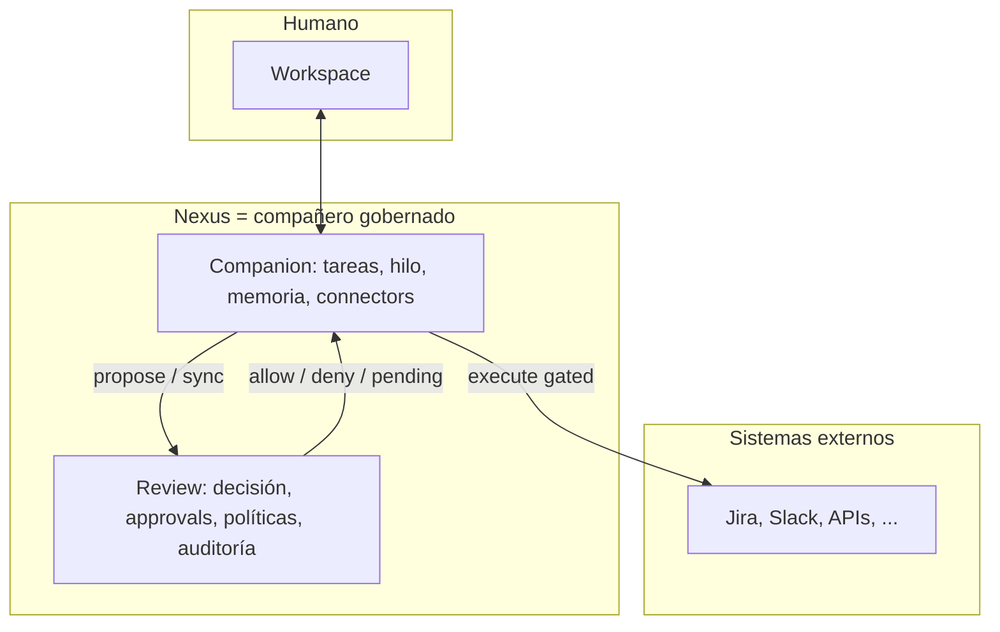

# Nexus — de capa de control a compañero de trabajo completo

Documento de **visión de producto**. Los detalles técnicos siguen en [NEXUS_ECOSYSTEM_DESIGN.md](./NEXUS_ECOSYSTEM_DESIGN.md) y el plan por fases en [NEXUS_COMPLETION_ROADMAP.md](./NEXUS_COMPLETION_ROADMAP.md).

---

## 1. Qué cambia en la cabeza (y qué no)

| Antes (mentalidad “solo control”) | Ahora (mentalidad “compañero completo”) |
|-----------------------------------|----------------------------------------|
| Nexus = dónde **frenan** las acciones peligrosas | Nexus = con **quién** trabajás el día: propone, recuerda, ejecuta lo permitido y **sigue** las reglas |
| Review es el producto; Companion es un anexo | **Review** sigue siendo el **cerebro soberano** de decisión y auditoría; **Companion** es el **cuerpo operativo** (tareas, hilo, ejecución gobernada) |
| El humano entra al inbox cuando algo falla | El humano tiene **bandeja de trabajo**, contexto, memoria de hechos y enlaces claros request ↔ task |
| Integración = “mandá request y listo” | Integración = **ciclo de vida**: investigar → proponer → decidir → (opcional) ejecutar en sistemas reales con trazabilidad |

**Lo que no negociamos:** Review **no** se convierte en chat ni en memoria larga. **No** evalúa políticas el Companion. **No** hay efectos secundarios externos sin pasar por la gobernanza acordada ([RFC-A](./NEXUS_ECOSYSTEM_DESIGN.md#rfc-a--companion-runtime-más-allá-del-vertical-slice), [RFC-C](./NEXUS_ECOSYSTEM_DESIGN.md#rfc-c--connectors-y-ejecución-post-review)).

---

## 2. Definición operativa: “compañero completo”

Un compañero completo, en este ecosistema, cumple **al menos** estos roles simultáneos:

1. **Entiende un objetivo** — Modelado como `Task` con mensajes y (futuro) plan explícito (`TaskPlan` / `context_json`).
2. **Mantiene continuidad** — Memoria operativa acotada: resúmenes y hechos por tarea, playbooks por org, preferencias por usuario ([RFC-B](./NEXUS_ECOSYSTEM_DESIGN.md#rfc-b--memory-continuidad-operativa-v1)).
3. **Respeta la autoridad** — Toda acción sensible pasa por Review según políticas; el compañero **orquesta**, no **legisla**.
4. **Actúa en el mundo** — Connectors con credenciales aisladas; ejecución gated post-decisión ([RFC-C](./NEXUS_ECOSYSTEM_DESIGN.md#rfc-c--connectors-y-ejecución-post-review)).
5. **Es usable como producto** — Workspace con home orientado a tareas, gobernanza visible y navegación por “áreas de trabajo”, no solo pestañas técnicas (Fase 5 del roadmap).

Hasta que esos cinco estén cubiertos en algún grado, hablamos de **compañero parcial** (hoy: slice fuerte en 1 + 3; 2, 4 y 5 en construcción).

---

## 3. Arquitectura mental (una sola figura)

- **Una sola promesa de producto:** “Nexus te acompaña en el trabajo operativo.”
- **Dos servicios, un flujo:** Companion sin Review es inseguro o incompleto; Review sin Companion es control sin brazos.

---

## 4. Mensaje para usuarios y para el equipo

**Pitch corto:**  
*Nexus es tu compañero de trabajo con IA: lleva tareas, recuerda lo importante y puede actuar en tus herramientas — siempre dentro de las reglas y con aprobación cuando corresponde.*

**Para ingeniería:**  
El “compañero completo” **no** es un monolito nuevo: es la **superficie unificada** (Workspace + Companion + Memory + Connectors) **montada sobre** Review como núcleo de gobernanza ya existente.

---

## 5. Cómo se traduce en trabajo (alineación con roadmap)

| Pilar del compañero | Dónde se construye (referencia) |
|---------------------|----------------------------------|
| Objetivo + ciclo de vida | Fase 1–2: FSM, sync Review, plan ligero, acciones `human_input` / `escalate` |
| Continuidad | Fase 3: Memory v1 (`task_summary`, `task_facts`, …) |
| Autoridad | Ya en Review + reglas Companion (sin duplicar CEL en Companion) |
| Acción en el mundo | Fase 4: Connectors + gating obligatorio |
| Producto usable | Fase 5: Workspace (home, links task ↔ request, IA de navegación) |
| Confianza en prod | Fase 6: auth humano, trazas, runbooks |

Orden sugerido en el roadmap: `0 → 1 → 2 → 4 → 5` con `3` en paralelo tras `0`; `6` en paralelo desde `1` (ver [NEXUS_COMPLETION_ROADMAP.md](./NEXUS_COMPLETION_ROADMAP.md)).

---

## 6. Criterio de éxito (“¿ya es compañero completo?”)

Checklist mínimo alineado con [NEXUS_COMPLETION_ROADMAP.md](./NEXUS_COMPLETION_ROADMAP.md#criterio-de-nexus-visión-base-completa):

- [ ] Task con ciclo de vida gobernado por Review (sync incluida) — *en gran parte hecho.*
- [ ] Memory v1 en uso para al menos resumen de task.
- [ ] Al menos un execute externo gated (mock + uno real trivial cuenta).
- [ ] Workspace con home + enlaces task ↔ request.
- [ ] Camino claro a auth no basado solo en API key en el browser.

Cuando esos ítems estén marcados, el producto puede declararse honestamente como **compañero de trabajo completo v1** (siempre con el matiz “gobernado”: no autónomo al margen de políticas).

---

## 7. Riesgos de lenguaje (evitar confusiones)

- **“Compañero completo” ≠ “agente sin límites”.** El límite es feature, no bug.
- **“Review deja de ser el centro” ≠ “Review desaparece”.** Sigue siendo la fuente de verdad de **decisión** y **prueba** ante auditoría.
- **No prometer memoria infinita** en v1: contradice compliance y el diseño de [RFC-B](./NEXUS_ECOSYSTEM_DESIGN.md#rfc-b--memory-continuidad-operativa-v1).

---

*Documento vivo: ajustar el pitch cuando cierre Fase 5 o al primer cliente design partner.*
